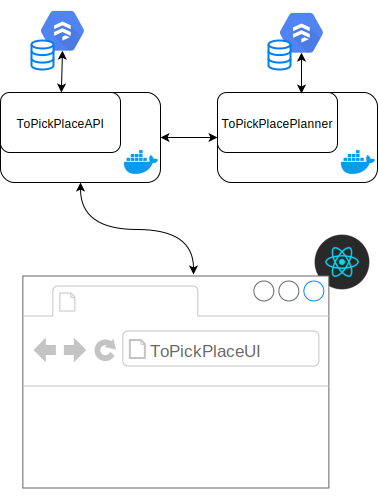

# ToPickPlace :construction: Work In Progress :construction:
This is my Pet Project (A project where I can experiment with new tecnologies and methodologies)

## The idea :bulb:
ToPickPlace assigns seats to all attendees for a given event.
The seats are assigned considering the topics which attendees are interesting to.

## Features
The user should be able to:
1. create an event
2. draw a seats map 
2. register attendees
3. select the topics in which they are interested
4. obtain the best seat assignment topic-based to increase the communication between attendees.

## Project Components
ToPickPlace consists of three main components:
- [ ] ToPickPlaceGUI: Single Page Application
- [x] ToPickPlaceAPI: WebAPI to handle the events
- [x] ToPickPlace Planner: a service to to assign seats based on a genetic algorithm

## Infrastructure

